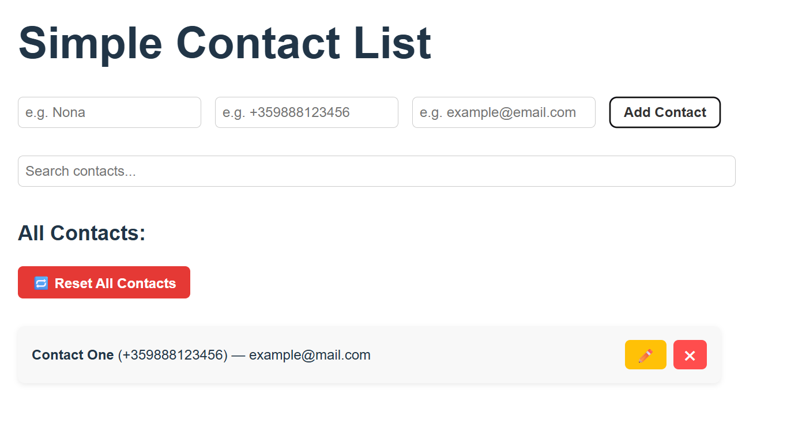

# 📇 Simple Contact List – React + TypeScript

This is a simple contact management app built using **React**, **TypeScript**, and **Vite**.

## 🖼️ Screenshot



## 🚀 Features

- Add new contacts with name, phone, and email
- Edit existing contacts with one click
- Delete individual contacts
- Live search by name, phone, or email
- LocalStorage support (contacts persist after refresh)
- Reset all contacts button
- Responsive and user-friendly form validations

## 🛠 Technologies

- React (with Hooks)
- TypeScript
- Vite
- CSS

## 🌐 Live Demo (GitHub Pages)

🔗 Coming soon...

## 📂 Project Setup

```bash
npm install
npm run dev
